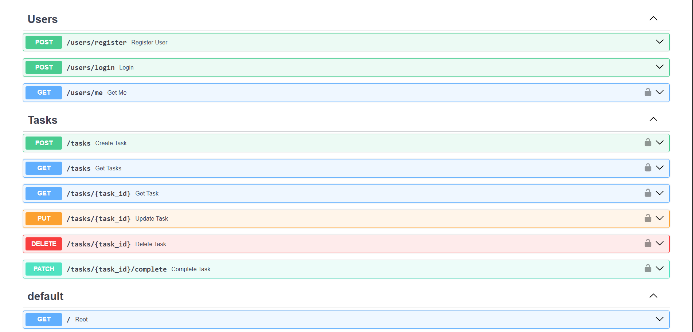

# FastAPI Todo API 🚀

A production-style FastAPI Todo REST API built with modern backend engineering practices including JWT Authentication, PostgreSQL, Docker, CI/CD, Testing, and Cloud Deployment.

This project was built to learn and demonstrate how real-world backend APIs are designed, tested, containerized, and deployed.

## 📷 API Documentation (Swagger UI)



## 🌐 Live Demo

**Production API:**
https://fastapi-todo-api-tbm4.onrender.com

**Swagger Documentation:**
https://fastapi-todo-api-tbm4.onrender.com/docs

## ✨ Features

### Authentication & Authorization
- User Registration
- User Login
- JWT Access Tokens
- Protected Routes
- Current User Dependency
- User-specific data access
- Ownership verification

### Task Management
- Create Task
- Get All Tasks
- Get Single Task
- Update Task
- Delete Task
- Mark Task as Completed

### Additional Features
- Pagination Support
- Request Logging Middleware
- Custom Exception Handling
- Environment Variables
- API Documentation with Swagger
- Unit Testing
- Docker Support
- CI/CD Pipeline
- Cloud Deployment

## 📚 Learning Phases and Implementation

### Phase 1 — Project Setup
**Implemented**
- FastAPI application setup
- Project structure
- Modular routing
- Environment variables

**Concepts Learned**
- APIRouter
- Dependency Injection
- Project organization

### Phase 2 — Database Integration
**Implemented**
- PostgreSQL database
- SQLAlchemy ORM
- Session management
- Database dependencies

**Concepts Learned**
- ORM vs Raw SQL
- Sessions
- Dependency Injection for DB

### Phase 3 — User Authentication
**Implemented**
- User registration
- Password hashing
- Password verification
- JWT token generation

**Concepts Learned**
- Authentication
- Password hashing
- Access Tokens
- Security best practices

### Phase 4 — Authorization
**Implemented**
- Protected endpoints
- OAuth2PasswordBearer
- Current user extraction
- Route protection

**Concepts Learned**
- Authorization
- Bearer Tokens
- Protected APIs

### Phase 5 — Task CRUD Operations
**Implemented**
- Create Task
- Read Task
- Update Task
- Delete Task

**Concepts Learned**
- REST APIs
- CRUD operations
- HTTP methods

### Phase 6 — Ownership Protection
**Implemented**

Users can only access their own tasks.

```python
task = db.query(Task).filter(
    Task.id == task_id,
    Task.owner_id == current_user.id
).first()
```

**Concepts Learned**
- Multi-user systems
- Data isolation
- Authorization rules

### Phase 7 — Task Completion Endpoint
**Implemented**
- `PATCH /tasks/{task_id}/complete`
- Allows users to mark tasks as completed

**Concepts Learned**
- PATCH requests
- Partial updates

### Phase 8 — Pagination
**Implemented**
- `GET /tasks?skip=0&limit=10`

**Concepts Learned**
- Offset Pagination
- Query Parameters
- Large dataset handling

### Phase 9 — Middleware and Exceptions
**Implemented**
- Request logging middleware
- Custom exceptions
- Error handling

**Concepts Learned**
- Middleware
- Request lifecycle
- Centralized error handling

### Phase 10 — Testing
**Implemented**
- Pytest
- TestClient
- Authentication tests
- User registration tests

**Concepts Learned**
- Unit Testing
- API Testing
- Test isolation

### Phase 11 — Dockerization
**Implemented**
- Dockerfile
- Docker Compose
- PostgreSQL container
- Multi-service setup

**Concepts Learned**
- Containerization
- Docker networking
- Environment variables in containers

### Phase 12 — Continuous Integration (CI)
**Implemented**

GitHub Actions pipeline:
- Install dependencies
- Run tests automatically
- Verify application integrity

**Concepts Learned**
- Automated testing
- CI pipelines
- GitHub Actions

### Phase 13 — Continuous Deployment (CD)
**Implemented**
- Render Auto Deploy
- Automatic deployments from GitHub

**Deployment flow:**
```
git push
    ↓
GitHub
    ↓
GitHub Actions (CI)
    ↓
Render Deployment (CD)
    ↓
Production Server Updated
```

**Concepts Learned**
- Deployment pipelines
- Production environments
- Automated releases

### Phase 14 — Cloud Deployment
**Implemented**
- Render deployment
- PostgreSQL integration
- Environment configuration

**Concepts Learned**
- Cloud Hosting
- Production deployment
- Environment management

## 📂 Project Structure

```
FastAPI-Todo-API
│
├── .venv
├── .vscode
├── alembic
│
├── app
│   ├── __pycache__
│   ├── api
│   ├── core
│   ├── dependencies
│   ├── exceptions
│   ├── middleware
│   ├── models
│   ├── schemas
│   ├── services
│   ├── main.py
│   ├── assets
│   │   └── swagger-ui.png
│   └── tests
│
├── .dockerignore
├── .env
├── .gitignore
├── alembic.ini
├── docker-compose.yml
├── Dockerfile
├── README.md
└── requirements.txt
```

## 🛠 Tech Stack

| Category | Technologies |
|---|---|
| **Backend** | FastAPI, Python 3.11 |
| **Database** | PostgreSQL, SQLAlchemy ORM |
| **Authentication** | JWT, OAuth2 |
| **Validation** | Pydantic |
| **Testing** | Pytest |
| **DevOps** | Docker, Docker Compose, GitHub Actions |
| **Deployment** | Render |

## 🔐 Authentication Flow

```
Register User
      ↓
Login User
      ↓
Receive JWT Token
      ↓
Send Token in Authorization Header
      ↓
Access Protected Routes
```

Example:
```
Authorization: Bearer YOUR_ACCESS_TOKEN
```

## 🚀 API Endpoints

### Users

| Method | Endpoint | Description |
|---|---|---|
| POST | `/users/register` | Register User |
| POST | `/users/login` | Login User |
| GET | `/users/me` | Get Current User |

### Tasks

| Method | Endpoint | Description |
|---|---|---|
| POST | `/tasks` | Create Task |
| GET | `/tasks` | Get All Tasks |
| GET | `/tasks/{task_id}` | Get Task |
| PUT | `/tasks/{task_id}` | Update Task |
| DELETE | `/tasks/{task_id}` | Delete Task |
| PATCH | `/tasks/{task_id}/complete` | Complete Task |

## 🧪 Run Locally

Clone repository:
```bash
git clone https://github.com/Sk2059/FastAPI-Todo-API.git
```

Install dependencies:
```bash
pip install -r requirements.txt
```

Run application:
```bash
uvicorn app.main:app --reload
```

## 🐳 Docker

Build containers:
```bash
docker compose build
```

Start containers:
```bash
docker compose up
```

## 👨‍💻 Author

**SK Singh**

GitHub: [@Sk2059](https://github.com/Sk2059)

## ⭐ Future Improvements

- Alembic Migrations
- Filtering
- Sorting
- Due Dates
- Priority Levels
- Soft Deletes
- Rate Limiting
- Background Tasks
- Redis Caching
- Async SQLAlchemy
- Celery Integration
